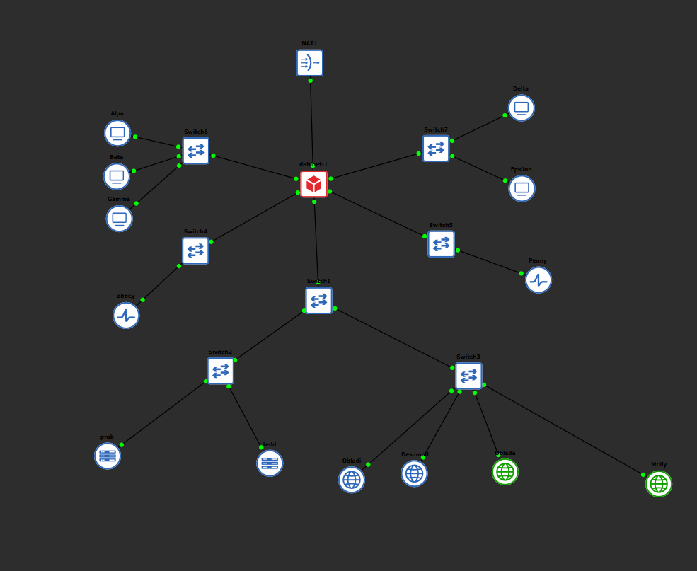
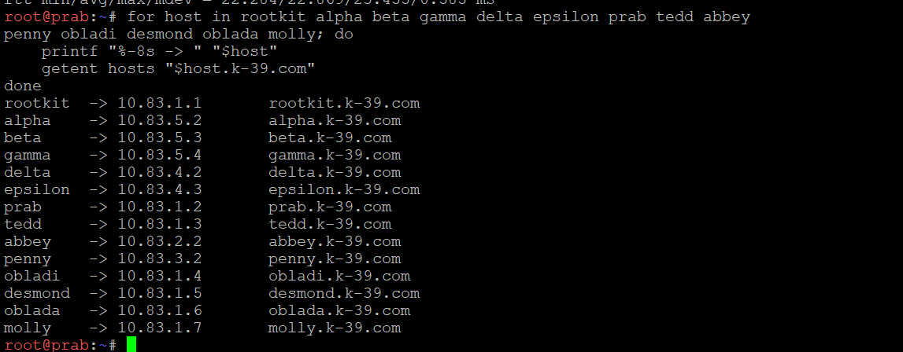

# Jarkom-Modul-2-2026-K-39

| Nama | NRP |
|---|---|
| Asfia Fahmisan | 5027251043 |
| Muhammad Atallah Mas'udi | 5027251071 |

1. Sebagai pusat kesadaran The Mesh, rootkit harus merentangkan koneksinya ke lima gerbang utama (Switch). Tetapkan alamat IP dan default gateway untuk seluruh Entitas, mulai dari para operator (alpha, beta, gamma), penjaga directory (prab, tedd), gerbang penyaring (abbey, penny), hingga repository (obladi, desmond, oblada, molly) sesuai dengan topologi pembagian switch yang dirancang. [GUNAKAN PREFIX IP MASING-MASING KELOMPOK].

    

    Setup jaringan telah kami sesuai dengan permintaan soal, yaitu dengan prefix ip masing-masing kelompok. Kalian bisa mengakses pada 
    [Klik di sini ](soal1,2,3,4,&5\setupRootkit.sh)

2. Meskipun The Mesh beroperasi dalam bayang-bayang, Rootkit menyadari bahwa Entitas di dalamnya masih membutuhkan asupan paket dari dunia luar. Buka jalur menuju NAT dengan memastikan antarmuka WAN di router rootkit aktif. Konfigurasikan NAT agar dapat meneruskan lalu lintas keluar bagi seluruh alamat internal, sehingga semua host di dalam jaringan dapat menjangkau internet publik menggunakan IP address.

    Setu NAT sudah dilakukan langsung di soal 1 dengan konfigurasi yang sama pada file [ini](soal1,2,3,4,&5\setupRootkit.sh)

    Berikut cuplikan kodenya : 
    ```bash
        auto eth0

        iface eth0 inet dhcp
            up iptables -t nat -A POSTROUTING -o eth0 -j MASQUERADE
            up iptables -A FORWARD -i eth1 -o eth0 -j ACCEPT
            up iptables -A FORWARD -i eth2 -o eth0 -j ACCEPT
            up iptables -A FORWARD -i eth3 -o eth0 -j ACCEPT
            up iptables -A FORWARD -i eth4 -o eth0 -j ACCEPT
            up iptables -A FORWARD -i eth5 -o eth0 -j ACCEPT
            up iptables -A FORWARD -i eth0 -m state --state ESTABLISHED,RELATED -j ACCEPT
            up sysctl -w net.ipv4.ip_forward=1
    ```

3. Jaringan rahasia tidak akan berfungsi tanpa sinkronisasi antar divisi. Pastikan seluruh Entitas dapat saling terhubung dan berkomunikasi lintas jalur (routing internal via rootkit berfungsi). Untuk menghindari fragmentasi saat persiapan, pastikan setiap host non-router menambahkan resolver 192.168.122.1 (tambah di file /etc/resolv.conf, kalau sudah pakai resolver itu tidak perlu memasukkan resolver google) saat antarmukanya aktif agar akses untuk mengunduh paket instalasi dari internet tersedia sejak awal beroperasi.

    Konfigurasi kami tambahkan ke setiap konfigurasi node.  pada folder [ini](/Jarkom-Modul-2-2026-K-39/soal1,2,3,4,&5/)

   Berikut cuplikan code-nya : 
   ```bash
    auto eth0
    iface eth0 inet static
        address 10.83.4.3
        netmask 255.255.255.0
        gateway 10.83.4.1
        up echo -e "nameserver 10.83.1.2\nnameserver 10.83.1.3\nnameserver 192.168.122.1" > /etc/resolv.conf
   ```

   Kami menggunkan technic echo untuk melakukan writing configurasi dns resolve ke file resolve.conf setiap kalai device nyala sehingga tidak perlu setting konfigurasi ke file dns setiap saat.

4. Penjaga Direktori mulai menuliskan hukum The Mesh. Pada node prab, bangun zona <xxxx>.com sebagai authoritative dengan SOA yang menunjuk ke prab.<xxxx>.com, serta tambahkan catatan NS untuk prab.<xxxx>.com dan tedd.<xxxx>.com. Buat A record untuk prab.<xxxx>.com dan tedd.<xxxx>.com yang mengarah ke alamat IP mereka masing-masing, serta A record apex <xxxx>.com yang mengarah ke gerbang aplikasi dinamis (penny). Aktifkan fitur notify dan allow-transfer ke tedd, lalu set forwarders ke 192.168.122.1. Di node tedd, tarik zona <xxxx>.com dari master dan pastikan server menjawab secara authoritative. Setelah fondasi nama ini berdiri kokoh, perbarui urutan resolver pada seluruh Entitas non-router menjadi: IP prab, IP tedd, lalu 192.168.122.1. Verifikasi bahwa query ke domain apex maupun hostname di dalam zona dijawab dengan benar oleh prab atau tedd. 

    Penjaga Direktori mulai menuliskan hukum The Mesh. Implementasi DNS menggunakan domain `k-39.com` dan dilakukan pada node `prab` serta `tedd` di folder [switch1/switch2](soal1,2,3,4,&5/switch1/switch2/).

    **Konfigurasi master pada prab**

    Node `prab` memiliki alamat `10.83.1.2`, sedangkan `tedd` memiliki alamat `10.83.1.3`. Konfigurasi jaringan pada [setupPrab.sh](soal1,2,3,4,&5/switch1/switch2/setupPrab.sh) menetapkan `10.83.1.1` sebagai gateway dan menulis urutan resolver berikut ke `/etc/resolv.conf` setiap kali antarmuka aktif:

    ```text
    nameserver 10.83.1.2
    nameserver 10.83.1.3
    nameserver 192.168.122.1
    ```

    Setelah memasang `bind9`, skrip [setupDNSPrab.sh](soal1,2,3,4,&5/switch1/switch2/setupDNSPrab.sh) mendaftarkan zona `k-39.com` sebagai `type master`. Artinya, `prab` menjadi DNS authoritative utama yang menyimpan salinan asli zona pada `/etc/bind/k-39/k-39.com`.

    Pengaturan `notify yes` membuat `prab` memberitahu server DNS slave ketika serial zona berubah. Sementara itu, `allow-transfer { 10.83.1.3; };` membatasi zone transfer hanya kepada `tedd`, sehingga server lain tidak dapat mengambil salinan zona secara sembarangan.

    Isi utama zona mendefinisikan:

    | Record | Nilai | Fungsi |
    | --- | --- | --- |
    | SOA | `prab.k-39.com.` | Menetapkan `prab` sebagai server authoritative dan sumber informasi serial zona. |
    | NS | `prab.k-39.com.` | Menetapkan DNS master. |
    | NS | `tedd.k-39.com.` | Menetapkan DNS slave/cadangan. |
    | `prab.k-39.com` | `10.83.1.2` | Alamat IP node master. |
    | `tedd.k-39.com` | `10.83.1.3` | Alamat IP node slave. |
    | `k-39.com` | `10.83.3.2` | Record apex yang mengarah ke `penny`, gateway aplikasi dinamis. |

    Forwarder pada `/etc/bind/named.conf.options` diarahkan ke `192.168.122.1`. Dengan demikian, query untuk domain di luar zona lokal dapat diteruskan ke DNS dari jaringan NAT. Opsi `allow-query { any; };` memungkinkan entitas di jaringan internal melakukan query ke server DNS.

    **Konfigurasi slave pada tedd**

    Skrip [setupDNSTedd.sh](soal1,2,3,4,&5/switch1/switch2/setupDNSTedd.sh) mendaftarkan `k-39.com` sebagai `type slave` dan menetapkan `10.83.1.2` sebagai master:

    ```bind
    zone "k-39.com" {
        type slave;
        masters { 10.83.1.2; };
        file "/etc/bind/k-39/k-39.com";
    };
    ```

    Saat layanan `bind9` dijalankan ulang, `tedd` meminta salinan zona dari `prab` melalui zone transfer. Salinan tersebut disimpan pada file yang sama di sisi slave. Karena data zona berasal dari master dan memuat SOA serta NS yang benar, `tedd` dapat melayani query untuk `k-39.com` sebagai DNS authoritative cadangan.

    **Urutan resolver dan verifikasi**

    Konfigurasi jaringan pada entitas non-router menggunakan urutan resolver `10.83.1.2`, `10.83.1.3`, kemudian `192.168.122.1`. Resolver akan mencoba `prab` terlebih dahulu, berpindah ke `tedd` apabila master tidak tersedia, dan memakai DNS NAT sebagai resolver terakhir.

    Verifikasi dapat dilakukan dari salah satu entitas non-router dengan perintah berikut:

    ```bash
    dig @10.83.1.2 k-39.com A
    dig @10.83.1.2 prab.k-39.com A
    dig @10.83.1.2 tedd.k-39.com A
    dig @10.83.1.3 k-39.com A
    dig @10.83.1.3 prab.k-39.com A
    dig @10.83.1.3 tedd.k-39.com A
    ```

    Hasil query apex `k-39.com` harus mengembalikan `10.83.3.2`, query `prab.k-39.com` mengembalikan `10.83.1.2`, dan query `tedd.k-39.com` mengembalikan `10.83.1.3`. Pada output `dig`, flag `aa` menunjukkan bahwa jawaban diberikan secara authoritative. Konfigurasi soal ini tersedia pada [setupDNSPrab.sh](soal1,2,3,4,&5/switch1/switch2/setupDNSPrab.sh), [setupDNSTedd.sh](soal1,2,3,4,&5/switch1/switch2/setupDNSTedd.sh), [setupPrab.sh](soal1,2,3,4,&5/switch1/switch2/setupPrab.sh), dan [setupTedd.sh](soal1,2,3,4,&5/switch1/switch2/setupTedd.sh).

5. "Entitas tanpa identitas adalah anomali," pesan Rootkit. Namai semua Entitas (hostname) sesuai glosarium: rootkit, alpha, beta, gamma, delta, epsilon, prab, tedd, abbey, penny, obladi, desmond, oblada, molly, dan verifikasi bahwa setiap host mengenali hostname tersebut secara system-wide. Buat setiap domain untuk masing-masing node sesuai dengan namanya (contoh: alpha.<xxxx>.com) dan assign IP masing-masing juga. Lakukan pengecualian untuk node yang bertanggung jawab atas prab dan tedd.

   **Identitas hostname dan pemetaan domain**

   Setiap entitas diberi hostname sesuai glosarium dan domain dengan pola `<hostname>.k-39.com`. Pengecualian berlaku untuk `prab` dan `tedd` karena keduanya merupakan node DNS: nama mereka digunakan sebagai server pada record SOA dan NS, serta `tedd` mengambil zona dari `prab` sebagai slave.

   Pemetaan hostname, domain, dan alamat IP yang digunakan adalah sebagai berikut:

   | Hostname | FQDN | Alamat IP |
   | --- | --- | --- |
   | `rootkit` | `rootkit.k-39.com` | `10.83.1.1` |
   | `alpha` | `alpha.k-39.com` | `10.83.5.2` |
   | `beta` | `beta.k-39.com` | `10.83.5.3` |
   | `gamma` | `gamma.k-39.com` | `10.83.5.4` |
   | `delta` | `delta.k-39.com` | `10.83.4.2` |
   | `epsilon` | `epsilon.k-39.com` | `10.83.4.3` |
   | `prab` | `prab.k-39.com` | `10.83.1.2` |
   | `tedd` | `tedd.k-39.com` | `10.83.1.3` |
   | `abbey` | `abbey.k-39.com` | `10.83.2.2` |
   | `penny` | `penny.k-39.com` | `10.83.3.2` |
   | `obladi` | `obladi.k-39.com` | `10.83.1.4` |
   | `desmond` | `desmond.k-39.com` | `10.83.1.5` |
   | `oblada` | `oblada.k-39.com` | `10.83.1.6` |
   | `molly` | `molly.k-39.com` | `10.83.1.7` |

   Record A untuk hostname tersebut ditulis pada zona `k-39.com` di [setupDNSPrabV2.sh](soal1,2,3,4,&5/switch1/switch2/setupDNSPrabV2.sh). Record apex `k-39.com` tetap mengarah ke `10.83.3.2`, yaitu alamat `penny`, sedangkan `prab.k-39.com` dan `tedd.k-39.com` tetap menjadi alamat nameserver sesuai konfigurasi soal 4.

   **Verifikasi identitas system-wide**

   Pada setiap host, hostname dapat diperiksa dengan perintah berikut:

   ```bash
   hostname
   hostnamectl --static
   hostnamectl status
   ```

   Nilai yang ditampilkan harus sama dengan nama entitas pada glosarium. Contohnya, pada node `alpha`, perintah `hostname` dan `hostnamectl --static` harus menghasilkan `alpha`. Pemeriksaan resolusi domain dapat dilakukan dari salah satu entitas non-router:

   ```bash
   for host in rootkit alpha beta gamma delta epsilon prab tedd abbey penny obladi desmond oblada molly; do
       printf "%-8s -> " "$host"
       getent hosts "$host.k-39.com"
   done
   ```

   

   Setiap baris harus mengembalikan FQDN dan alamat IP yang sesuai pada tabel. Dengan demikian, identitas lokal diverifikasi oleh `hostname`/`hostnamectl`, sedangkan identitas jaringan diverifikasi melalui resolusi DNS dari zona authoritative `k-39.com`.

6. Pastikan zone transfer berjalan, pastikan tedd telah menerima salinan zona terbaru dari prab. Nilai serial SOA di keduanya harus sama karena keduanya tidak bisa dipisahkan dan saling melengkapi.

    **Verifikasi zone transfer master-slave**

    Zone transfer untuk zona `k-39.com` dikendalikan oleh `prab` sebagai master dan `tedd` sebagai slave. Pada konfigurasi master, `notify yes` mengirim pemberitahuan perubahan zona kepada slave, sedangkan `allow-transfer { 10.83.1.3; };` mengizinkan transfer hanya ke alamat IP `tedd`.

    Setelah `bind9` dijalankan ulang pada kedua node, SOA zona diperiksa dari `prab` dan `tedd` menggunakan [verifikasiSukses.sh](soal6/verifikasiSukses.sh):

    ```bash
    dig @10.83.1.2 k-39.com SOA +short
    dig @10.83.1.3 k-39.com SOA +short
    ```

    Hasil verifikasi pada kedua server adalah:

    ```text
    prab.k-39.com. root.k-39.com. 2025100401 604800 86400 2419200 604800
    prab.k-39.com. root.k-39.com. 2025100401 604800 86400 2419200 604800
    ```

    Nilai serial SOA `2025100401` pada `prab` dan `tedd` sama. Hal ini menunjukkan bahwa `tedd` telah menerima salinan zona dengan versi yang sama dari `prab`, sehingga data master dan slave sudah sinkron. Selain serial, parameter refresh, retry, expire, dan negative cache TTL juga sama karena seluruh data SOA berasal dari zona yang ditransfer.

    Dengan demikian, apabila zona pada `prab` diperbarui, serial harus dinaikkan agar `tedd` mengetahui bahwa salinan lamanya perlu diperbarui. Setelah notifikasi dan transfer selesai, query SOA ke kedua alamat DNS kembali harus menghasilkan serial yang sama.

7. abbey dan penny sebagai gerbang utama, obladi dan desmond sebagai web statis, oblada dan molly sebagai web dinamis. Tambahkan pada zona <xxxx>.com A record untuk vault.<xxxx>.com (IP obladi & desmond), dan core.<xxxx>.com (IP oblada & molly). Tetapkan CNAME:
www.<xxxx>.com → penny.<xxxx>.com
static.<xxxx>.com → abbey.<xxxx>.com
Verifikasi dari dua klien berbeda bahwa seluruh hostname tersebut ter-resolve ke tujuan yang benar dan konsisten.

    **Pembagian layanan dan record DNS**

    Pada soal ini, `penny` dan `abbey` menjadi gerbang utama aplikasi. `penny` meneruskan akses ke kelompok web dinamis melalui alias `www`, sedangkan `abbey` menjadi gerbang untuk kelompok web statis melalui alias `static`. Backend web statis terdiri dari `obladi` dan `desmond`, sementara backend web dinamis terdiri dari `oblada` dan `molly`.

    Konfigurasi zona pada [setupDNSPrabV3.sh](soal7/setupDNSPrabV3.sh) menambahkan record berikut pada zona `k-39.com`:

    | Record | Tipe | Nilai | Keterangan |
    | --- | --- | --- | --- |
    | `vault.k-39.com` | A | `10.83.1.4`, `10.83.1.5` | Mengarah ke `obladi` dan `desmond` sebagai backend web statis. |
    | `core.k-39.com` | A | `10.83.1.6`, `10.83.1.7` | Mengarah ke `oblada` dan `molly` sebagai backend web dinamis. |
    | `www.k-39.com` | CNAME | `penny.k-39.com.` | Alias untuk gerbang aplikasi dinamis `penny`. |
    | `static.k-39.com` | CNAME | `abbey.k-39.com.` | Alias untuk gerbang aplikasi statis `abbey`. |

    Record A ganda pada `vault` dan `core` membuat DNS dapat mengembalikan dua alamat backend. Dengan begitu, request dapat diarahkan ke salah satu server dalam kelompok layanan yang sesuai. Record CNAME membuat pengguna cukup mengakses nama layanan `www.k-39.com` atau `static.k-39.com` tanpa perlu mengetahui alamat IP gerbangnya.

    **Verifikasi dari dua klien**

    Skrip [verifikasiSukses.sh](soal7/verifikasiSukses.sh) menguji keempat hostname menggunakan `ping`:

    ```bash
    ping -c 2 www.k-39.com
    ping -c 2 static.k-39.com
    ping -c 2 vault.k-39.com
    ping -c 2 core.k-39.com
    ```

    Perintah tersebut dijalankan dari dua klien berbeda, misalnya `alpha` dan `beta`. Hasil pada kedua klien harus sama-sama menunjukkan resolusi yang berhasil, tanpa packet loss, dengan tujuan berikut:

    - `www.k-39.com` mengarah ke `penny.k-39.com` atau `10.83.3.2`.
    - `static.k-39.com` mengarah ke `abbey.k-39.com` atau `10.83.2.2`.
    - `vault.k-39.com` mengarah ke `10.83.1.4` atau `10.83.1.5`.
    - `core.k-39.com` mengarah ke `10.83.1.6` atau `10.83.1.7`.

    Bukti pengujian resolusi dan konektivitas dapat dilihat pada [image.png](soal7/image.png). Untuk memeriksa seluruh alamat A record secara eksplisit, gunakan `dig` dari masing-masing klien:

    ```bash
    dig vault.k-39.com A +short
    dig core.k-39.com A +short
    dig www.k-39.com CNAME +short
    dig static.k-39.com CNAME +short
    ```

    Jika hasil dari kedua klien berisi tujuan yang sama dan seluruh hostname dapat di-ping, maka konfigurasi record A, CNAME, dan konektivitas antar jaringan telah berjalan konsisten.

8. Di prab (master) deklarasikan reverse zone untuk segmen jaringan  tempat abbey, penny, area vault, dan area core berada. Di tedd (slave) tarik reverse zone tersebut sebagai slave, isi PTR untuk keempat hostname itu agar pencarian balik IP address mengembalikan hostname yang benar, lalu pastikan query reverse untuk alamat abbey, penny, area vault, dan area core dijawab authoritative.

    **Konfigurasi reverse zone pada prab**

    Reverse DNS menggunakan zona `in-addr.arpa`, dengan urutan oktet IP dibalik. Karena entitas yang diuji berada pada tiga segmen berbeda, `prab` mendeklarasikan tiga reverse zone pada [setupDNSPrabV4.sh](soal8/setupDNSPrabV4.sh):

    | Reverse zone | Segmen jaringan | Entitas yang diuji |
    | --- | --- | --- |
    | `1.83.10.in-addr.arpa` | `10.83.1.0/24` | `vault` dan `core` |
    | `2.83.10.in-addr.arpa` | `10.83.2.0/24` | `abbey` |
    | `3.83.10.in-addr.arpa` | `10.83.3.0/24` | `penny` |

    Ketiga zona ditetapkan sebagai `type master`, menggunakan file zona masing-masing, mengaktifkan `notify`, dan membatasi zone transfer hanya kepada `tedd` (`10.83.1.3`). Setiap zona juga memuat `prab.k-39.com` dan `tedd.k-39.com` sebagai nameserver.

    **PTR record**

    PTR pada reverse zone memetakan alamat IP kembali ke hostname canonical berikut:

    | Alamat IP | Query reverse | Jawaban PTR |
    | --- | --- | --- |
    | `10.83.1.4` | `4.1.83.10.in-addr.arpa` | `vault.k-39.com` |
    | `10.83.1.5` | `5.1.83.10.in-addr.arpa` | `vault.k-39.com` |
    | `10.83.1.6` | `6.1.83.10.in-addr.arpa` | `core.k-39.com` |
    | `10.83.1.7` | `7.1.83.10.in-addr.arpa` | `core.k-39.com` |
    | `10.83.2.2` | `2.2.83.10.in-addr.arpa` | `abbey.k-39.com` |
    | `10.83.3.2` | `2.3.83.10.in-addr.arpa` | `penny.k-39.com` |

    `vault` dan `core` masing-masing memiliki dua alamat IP karena setiap layanan memiliki dua backend. Oleh sebab itu, kedua alamat pada masing-masing kelompok diberi PTR yang sama.

    **Konfigurasi slave pada tedd**

    Pada [setupDNSTeddV2.sh](soal8/setupDNSTeddV2.sh), `tedd` mendaftarkan ketiga reverse zone sebagai `type slave` dengan master `10.83.1.2`. Setelah `bind9` dijalankan ulang, `tedd` menarik file `1.83.10.in-addr.arpa`, `2.83.10.in-addr.arpa`, dan `3.83.10.in-addr.arpa` dari `prab`.

    **Verifikasi authoritative reverse DNS**

    Verifikasi dasar tersedia pada [verifikasiSuksesConfig.sh](soal8/verifikasiSuksesConfig.sh):

    ```bash
    host -t PTR 10.83.1.4
    host -t PTR 10.83.1.6
    host -t PTR 10.83.2.2
    host -t PTR 10.83.3.2
    ```

    Untuk memastikan jawaban diberikan secara authoritative oleh master dan slave, query dapat diarahkan langsung ke kedua DNS berikut:

    ```bash
    dig @10.83.1.2 -x 10.83.1.4 PTR +short
    dig @10.83.1.2 -x 10.83.1.6 PTR +short
    dig @10.83.1.2 -x 10.83.2.2 PTR +short
    dig @10.83.1.2 -x 10.83.3.2 PTR +short

    dig @10.83.1.3 -x 10.83.1.4 PTR +short
    dig @10.83.1.3 -x 10.83.1.6 PTR +short
    dig @10.83.1.3 -x 10.83.2.2 PTR +short
    dig @10.83.1.3 -x 10.83.3.2 PTR +short
    ```

    Hasil yang diharapkan adalah `vault.k-39.com`, `core.k-39.com`, `abbey.k-39.com`, dan `penny.k-39.com`. Flag `aa` pada output `dig` menunjukkan bahwa jawaban reverse query bersifat authoritative. Bukti konfigurasi dan hasil pengujian juga tersedia pada [image.png](soal8/image.png).


9. Jalankan layanan web statis pada hostname di node area vault (menggunakan apache). Buka folder direktori /arsip/ dan aktifkan fitur autoindex (directory listing) pada konfigurasi Apache sehingga seluruh daftar file di dalamnya dapat ditelusuri langsung dari browser. Akses pengujian harus dilakukan melalui hostname, bukan IP address.

   **Konfigurasi Apache pada area vault**

   Layanan web statis dijalankan pada node `obladi` dan `desmond` menggunakan skrip [setupWebStaticAutoindex.sh](soal9/setupWebStaticAutoindex.sh). Skrip tersebut memasang `apache2`, mengaktifkan modul `autoindex`, membuat document root `/var/www/static`, dan menyiapkan direktori arsip `/var/www/static/arsip` beserta file `readme.txt`.

   VirtualHost Apache menggunakan hostname `vault.k-39.com` sebagai `ServerName`, dengan `obladi.k-39.com` dan `desmond.k-39.com` sebagai `ServerAlias`. Dengan konfigurasi ini, request dibedakan berdasarkan hostname yang dikirim melalui HTTP, sehingga pengujian tidak dilakukan menggunakan alamat IP langsung.

   ```apache
   <VirtualHost *:80>
       ServerName vault.k-39.com
       ServerAlias obladi.k-39.com desmond.k-39.com
       DocumentRoot /var/www/static

       <Directory /var/www/static/arsip>
           Options +Indexes +FollowSymLinks
           AllowOverride None
           Require all granted
       </Directory>
   </VirtualHost>
   ```

   Opsi `+Indexes` mengaktifkan directory listing khusus pada `/arsip/`. Oleh karena itu, browser dapat menampilkan daftar file ketika direktori tersebut diakses, sementara isi document root tetap menggunakan `index.html` sebagai halaman utama. Skrip juga memberikan kepemilikan file kepada `www-data` dan permission `755` agar Apache dapat membaca seluruh konten.

   **Verifikasi melalui hostname**

   Setelah `apache2ctl configtest` menghasilkan `Syntax OK` dan layanan Apache dijalankan ulang, URL pengujian yang digunakan adalah:

   ```text
   http://vault.k-39.com/arsip/
   ```

   Untuk verifikasi dari terminal tanpa menggunakan IP address, jalankan:

   ```bash
   curl -i http://vault.k-39.com/arsip/
   curl -s http://vault.k-39.com/arsip/ | grep -i "Index of"
   ```

   Response harus berhasil dan menampilkan directory listing, termasuk file `readme.txt`. Pengujian dengan `http://10.83.1.4/arsip/` atau `http://10.83.1.5/arsip/` tidak digunakan karena soal meminta akses melalui hostname. Bukti konfigurasi dan hasil pengujian tersedia pada [image.png](soal9/image.png).

10. Jalankan layanan web dinamis (PHP-FPM) pada hostname di node core (menggunakan nginx). Buat sebuah aplikasi sederhana yang memuat halaman beranda dan halaman profil. Terapkan aturan rewrite pada server sehingga akses ke /profil dapat berfungsi dengan URL bersih (tanpa akhiran .php). Akses pengujian wajib dilakukan melalui hostname.

    **Konfigurasi aplikasi dinamis pada node core**

    Layanan web dinamis dipasang pada node area `core` menggunakan Nginx dan PHP-FPM melalui skrip [setupWebDinamisPHP.sh](soal10/setupWebDinamisPHP.sh). Skrip memasang paket `nginx` dan `php-fpm`, mendeteksi versi PHP yang tersedia, lalu menjalankan service PHP-FPM beserta socket FastCGI-nya.

    Aplikasi diletakkan pada `/var/www/core` dan terdiri dari dua halaman:

    - `index.php` sebagai halaman beranda. Halaman ini menampilkan hostname server dan waktu server menggunakan PHP, serta menyediakan tautan ke `/profil`.
    - `profil.php` sebagai halaman profil. Halaman ini menampilkan status bahwa PHP-FPM berhasil dieksekusi melalui clean URL dan menyediakan tautan kembali ke beranda.

    VirtualHost Nginx menggunakan hostname berikut:

    ```nginx
    server_name core.k-39.com oblada.k-39.com molly.k-39.com;
    root /var/www/core;
    index index.php index.html;
    ```

    Dengan konfigurasi tersebut, request PHP diteruskan ke socket PHP-FPM menggunakan `fastcgi_pass`. Aturan rewrite berikut mengubah URL bersih `/profil` menjadi file aplikasi `/profil.php` secara internal:

    ```nginx
    rewrite ^/profil/?$ /profil.php last;
    ```

    Pengguna tetap mengakses `/profil` tanpa melihat atau menuliskan akhiran `.php`. Sementara itu, `try_files` memastikan request lain hanya dilayani apabila file atau direktori yang diminta memang tersedia.

    **Verifikasi melalui hostname**

    Setelah `nginx -t` menghasilkan konfigurasi valid dan service Nginx serta PHP-FPM dijalankan ulang, pengujian dilakukan menggunakan hostname, bukan alamat IP:

    ```bash
    curl -i http://core.k-39.com/
    curl -i http://core.k-39.com/profil
    ```

    Request ke `/` harus menampilkan halaman beranda serta hostname server. Request ke `/profil` harus menghasilkan halaman profil dengan status HTTP berhasil, tanpa perlu mengakses `http://10.83.1.6/profil` atau menuliskan `/profil.php` pada URL. Jika browser digunakan, alamat pengujiannya adalah:

    ```text
    http://core.k-39.com/
    http://core.k-39.com/profil
    ```

    Bukti hasil aplikasi dinamis dan clean URL tersedia pada [image.png](soal10/image.png).
